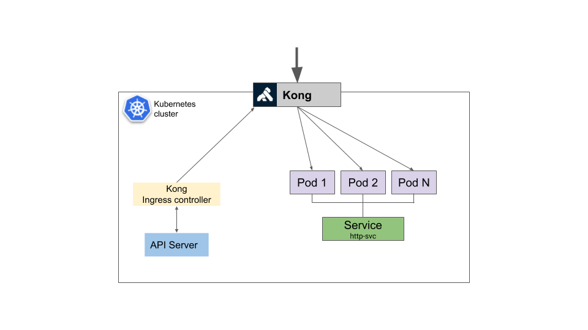

<h1 align="center">Kong Operator</h1>

### Overview:

Kong is a popular open-source cloud-native API gateway. Kong Operator is a Kubernetes operator which manages Kong and Kong Enterprise clusters.
With Kong Operator running in your cluster, you can spin up multiple instances of Kong, each of them configured by a Kong custom resource.

Kong Operator can deploy Kong in various configurations, for example:

- as a Kubernetes ingress controller, enabling you to expose Kubernetes Services via Kong,
- a standalone Kong gateway (without the ingress controller; either DB-enabled or DB-less)
- a standalone Ingress Controller (configuring an external instance of Kong)

### Kong's features are as follows:

- Kong is a high performance, open source API gateway, traffic control, and microservice management layer that supports the demanding networking requirements these workloads     
  have. 

- To serve traffic for a deep ecosystem of software and enterprises, Kong comes supplied with a rich plugin ecosystem that extends Kong with features for authentication, traffic   control, and more.

- Kong is one of the popular opensource API gateways which can help us to manage APIs deployed anywhere from a simple infrastructure to a complex multi-cloud environment. 

- Kong’s   ability to handle different protocols like REST, GRPC, Graphql enables us to manage almost all of our APIs. 

### Kong's Architecture:

By integrating with the Kubernetes Ingress Controller spec, Kong ties directly to the Kubernetes lifecycle. As applications are deployed and new services are created, Kong will automatically live configure itself to serve traffic to these services.

Below is a high-level architectural diagram of Kong api in kubernetes cluster:

### Objective of tutorial

In this tutorial,we are going to cover following topics:

1. Install Kong Operator and verify its successful installation.
2. Create Kong Instance to deploy Kong Ingress Controller and verify status of pods and services.
3. Deploy an example application Service and expose it with kong Ingress.
4. Verify that Kong ingress works and relays requests to the application.
5. Cleanup Operator.
